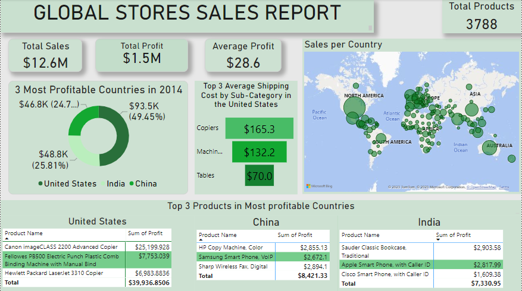
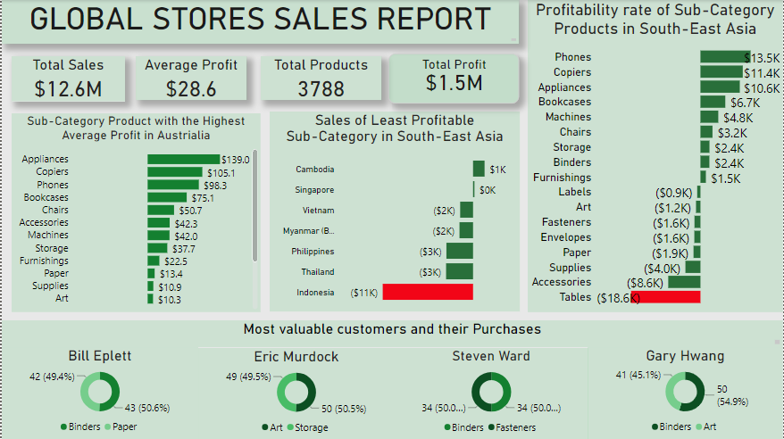
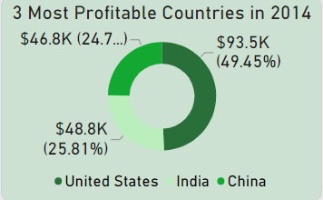
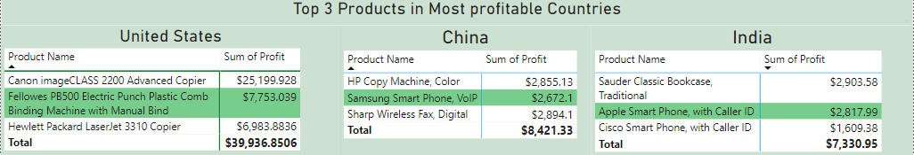
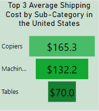
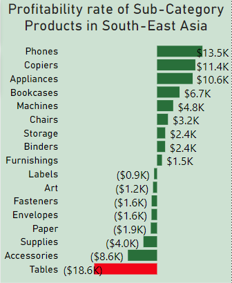
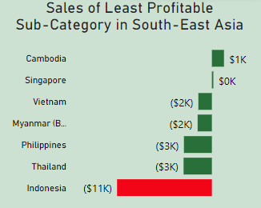
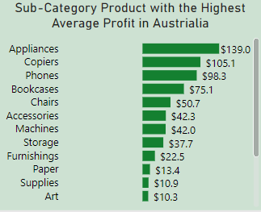

# Global Super Stores Sales Report (2011-2015)
## Introduction
This report presents the results of a data analysis on the Superstore dataset, which contains information about the sales and profits of Global Superstore, an online retailer that operates in 147 countries and sells 3,788 products in various categories.

Disclaimer: All dataset does not represent any company but just a dummy datasets to demonstarate capabilities of Excel, Power BI.

## Problem Statement
1. What are the three countries that generated the highest total profit for Global Superstore in 2014?
2. What are top three products with the highest profit from the three countries gotten above?
3. What are the top 3 subcategories with the highest average shipping cost in the United States?
4. Which product subcategory is the least profitable in Southeast Asia?
5. Which product subcategory has the highest average profit in Australia?
6. Which of our customers are most valuable?

## Data Sourcing
The data used for this analysis was given by Ruby Ihekweme (Mentor at DigitaleyNG) as a prerequisite for the completion of the Data Analysis Training hosted by DigitaleyNG.

It contains 3 sheets/tables:
1.	ORDERS with 51,291 rows and 24 columns
2.	PEOPLE with 24 rows and 2 columns
3.	RETURNS with 1079 rows and 3 columns

## Data Transformation/Cleaning
Data was efficiently cleaned and transformed with the Power Query Editor of Power BI and excel.
- The data set for ORDERS was formatted into a table, making first rows as headers in excel
- Applied the fixed decimal number format to the columns that represented monetary values, such as shipping cost, profit, and sales.

  ## Data Analysis and Visuals

  Dashboard 1
  
  
  
  Dashboard 2
  
  

**1. What are the three countries that generated the highest total profit for Global Superstore in 2014?**

Despite generating a total profit of $504.2 in 2014, Global Superstore's profit distribution was uneven across countries. In fact, only three countries accounted for nearly half of the company's total profit. These Countries are:
- United States with total profit of $93.5k
- Followed by India with $48.8k
- And Lastly, China with the total profit of $46.8k.

This suggests that Global Superstore's performance varies across different countries. It is important for the store to identify the factors that contribute to its success in certain markets and replicate these factors in other markets.

**2. The top 3 products for each of these countries are shown below**

**3. What are the top 3 subcategories with the highest average shipping cost in the United States?**

Shipping cost is a key factor that affects a business's profitability. We examine the average shipping cost for each sub-category, in the United States from 2011 to 2014.
From the Analysis:
- Tables had the lowest average shipping cost among the three subcategories from 2011 to 2015, with an average of $70.0 per order.
- Machines had an average shipping cost of $132.2 per order.
- Copiers had the highest average shipping cost, at $165.3 per order.

These findings suggest that copiers are more expensive to ship than tables and machines. This could be due to a number of factors, such as the weight and dimensions of copiers, the need for special packaging to protect them from damage during shipping, and the use of specialized shipping carriers.

**4. Which product subcategory is the least profitable in Southeast Asia?**

Based on our analysis, the product subcategories in Southeast Asia that had the least profit are the table sub category with a profit of -$18.6k.

As deduced from the chart below, the table subcategory should not be offered to Indonesia due to its low profit gained from the sales of this particular category.

**5. Which product subcategory has the highest average profit in Australia?**

The subcategory products that generate the most profit in Australia are appliances, copiers and phones, according to the chart above. These products have an average profit of $139.0, $105.1 and $98.3 per unit, respectively, which are significantly higher than the other subcategories.

**6. Which of our customers are most valuable?**

To identify the most valuable customers in our sales data, we used the total number of quantities demanded to rank them. We found that the most valuable customers based on our mode of selection are:
- **Steve Ward**: demanded 106 quantities of different products but most of the product he demanded are from the Fasteners and Blinders categories.
- **Bill Eplett**: demanded 102 quantities of different products but most of the product he demanded are from the Paper and Blinders categories.
- **Gary Hawng**: demanded 102 quantities of different products but most of the product he demanded are from the Art and Blinders categories.
- **Eric Murdock**: demanded 100 quantities of different products but most of the product he demanded are from the Storage and Art categories.

## Conclusion/Recommendation
- Global Super Store should reduce production on the least profitable sub-categories like Tables, Supplies, Envelopes, Fasteners and Labels in South Asia.

